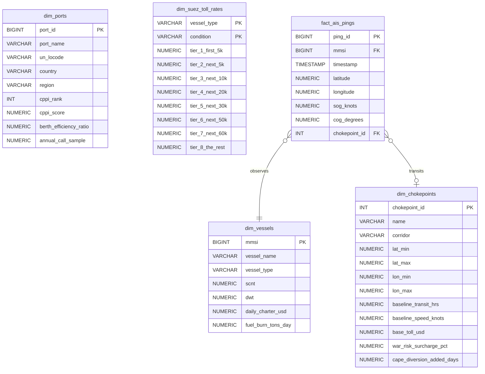

# Maritime Route Risk Intelligence & Analytics

[](https://www.python.org/)
[](https://duckdb.org/)
[](https://www.postgresql.org/)
[]()
[](LICENSE)

A high-performance data engineering and maritime analytics platform designed to analyze global vessel traffic, evaluate maritime corridor risk, and calculate transit dues across strategic maritime chokepoints.

---

## 📌 Phase 1 Highlights

- **Automated Data Discovery**: Programmatic scanner for local `~/Downloads` that discovers and stages AIS archives (`.tgz`, `.zip`, `.csv`) and World Bank CPPI spreadsheets without manual copying.
- **Kinematic Coordinate Validator**: Chunked stream ingestion engine for large-scale AIS data (millions of observations), enforcing rigorous spatial $[-90, 90] \times [-180, 180]$ bounds, SOG/COG validation, and geofence tagging.
- **World Bank CPPI Ingestion**: Cleans, standardizes, and normalizes container port performance metrics across 400+ international ports.
- **Official Suez Canal Authority (SCA) Rate Cards**: Modeled 2024 progressive SDR tariff cards for all 13 vessel categories in Laden and Ballast conditions.
- **Progressive Toll Calculator**: Dynamic engine calculating transit dues across progressive tonnage tiers, validated against official circulars (e.g., 120k SCNT Container Ship = $664,601.00 USD).
- **Dual-Engine Architecture**: High-speed embedded OLAP via **DuckDB** alongside production relational DDL for **PostgreSQL**.

---

## 🏗️ Project Architecture

```
maritime-trade-risk-analytics/
├── data/
│   ├── raw/
│   │   ├── dim_ports_clean.csv            # Cleaned global port performance benchmarks
│   │   ├── dim_suez_toll_tiers.csv        # Progressive SCA rate cards
│   │   └── dim_chokepoints.csv            # Strategic corridor geofences
│   ├── processed/                         # Validated telemetry & extracted vessel register
│   └── maritime_risk.duckdb               # Embedded columnar OLAP store
├── sql/
│   ├── 01_schema.sql                      # Relational DDL & performance B-Tree indexes
│   ├── 02_seed_suez_tolls.sql             # SCA tariff SQL seeds
│   └── 03_seed_chokepoints.sql            # Chokepoint bounds SQL seeds
├── src/
│   ├── ingestion/
│   │   ├── stage_downloads.py             # Automatic downloads discovery & staging
│   │   ├── ingest_ais.py                  # Chunked streaming AIS parser & validator
│   │   ├── ingest_cppi.py                 # CPPI Excel parser & normalizer
│   │   └── seed_reference_data.py         # Static dimension seeder
│   ├── db/
│   │   └── db_loader.py                   # DuckDB & PostgreSQL batch loader
│   └── models/
│       └── suez_calculator.py             # Progressive slab dues calculator in USD
├── tests/
│   ├── test_suez_calculator.py            # Progressive slab unit tests
│   └── test_ingestion.py                  # Validation and geofence tests
├── requirements.txt                       # Python dependencies
└── run_phase1.py                          # Master end-to-end pipeline driver
```

---

## 🚀 Quickstart

### 1. Installation
Clone the repository and install dependencies:
```bash
git clone https://github.com/Devananditha/maritime-trade-risk-analytics.git
cd maritime-trade-risk-analytics
pip install -r requirements.txt
```

### 2. Run Master Pipeline
Execute the end-to-end ingestion, schema creation, database load, and analytical verification:
```bash
python run_phase1.py
```

### 3. Run Automated Tests
```bash
pytest -v tests/
```

---

## 📊 Database Schema



---

## 🧮 Progressive Toll Calculation

Suez transit dues are calculated progressively in Special Drawing Rights (SDR) and converted to USD:

$$\text{Transit Dues (USD)} = \left(\sum_{i=1}^{N} \text{Tonnage}_i \times \text{Rate}_i\right) \times \text{SDR\_to\_USD}$$

Example for a **120,000 SCNT Laden Container Ship** (@ SDR = $1.33 USD):
- **First 5,000 SCNT** @ 11.04 SDR = 55,200.00 SDR
- **Next 5,000 SCNT** @ 7.58 SDR = 37,900.00 SDR
- **Next 10,000 SCNT** @ 5.89 SDR = 58,900.00 SDR
- **Next 20,000 SCNT** @ 4.13 SDR = 82,600.00 SDR
- **Next 30,000 SCNT** @ 3.82 SDR = 114,600.00 SDR
- **Next 50,000 SCNT** @ 3.01 SDR = 150,500.00 SDR
- **Total Dues**: **499,700.00 SDR** $\times$ 1.33 = **$664,601.00 USD**
